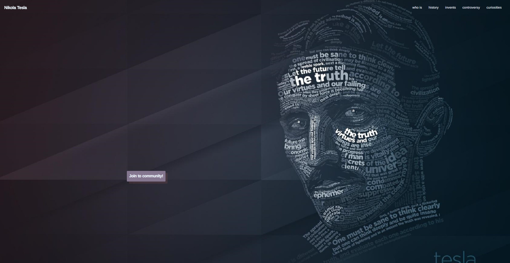
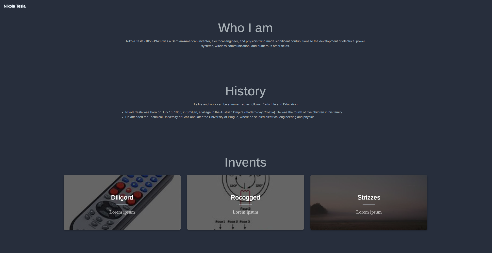
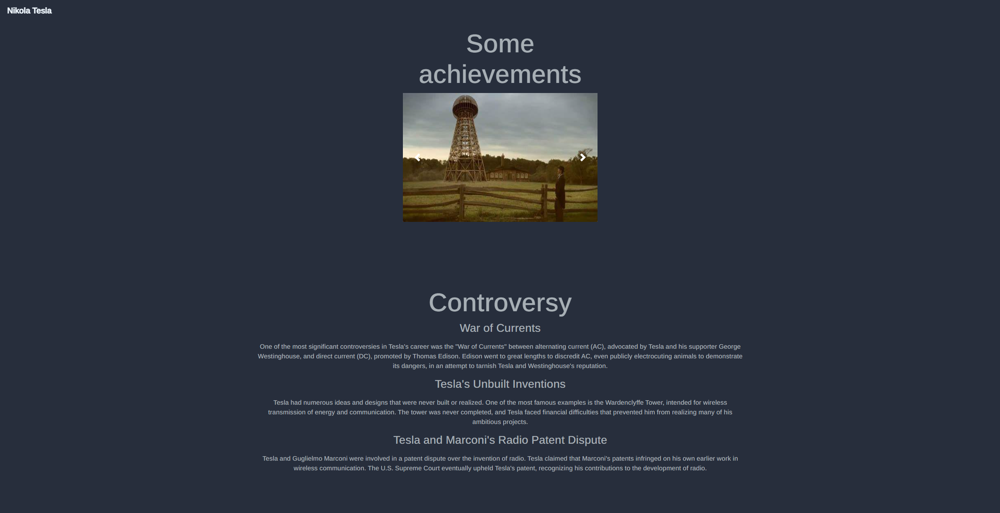
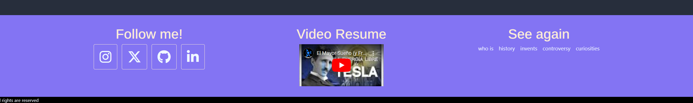

<h1>Memoria del proyecto fin de evaluación de Lenguajes de Marcas - 1º DAM/DAW</h1>
<h2>Nikola Tesla - A tribute site</h2>
<h2>Indice</h2>
<ul>
  <li><a href="#introduccion">Introducción</a></li>
  <li><a href="#motivacion">Motivación</a></li>
  <li><a href="#estructura">Estructura</a></li>
  <li><a href="#estilo">Estilo</a></li>
</ul>

<h2 id="introduccion">Introducción</h2>

Trabajo realizado en clase por: Antonio J. Heredia Leiva

Proyecto de web "from scratch" de 1ª evaluación de Lenguajes de Marcas

Diciembre de 2023 

Licencia CC-BY

<h2 id="motivacion">Motivación</h2>

Tema elegido porque soy fan de Nikola Tesla, y no por los coches que tenemos ahora, sino porque pienso que es uno de los inventores mas influyentes que nos ha permitido avanzar técnologicamente haciando donde estamos ahora y haciando donde vayamos

<h2 id="estructura">Estructura</h2>

La web está dividida en 3 secciones principales con sus distintas subdivisiones

<ul>
  <li>
  
Hero Section

    <ul>
        <li>Barra de navegación</li>
        <li>Botón call to action</li>
    </ul>
  </li>  
  <li>
  
Main container

    <ul>
        <li>Secciones informativas </li>
        <li>Seccion informativas con cards</li>
        <li>Secciones informativas con carrosel + bootstrap</li>
        <li>Botón call to action</li>
    </ul>
  </li>
  <li>Footer</li>
</ul>

<h3>Hero Section</h3>

He utilizado una imagen de fondo tomada de google images que se adapta fácilmente a diferentes dispositivos 
El color de la imagen es tal cual la encontré en google, pero me parecia el correcto, ya que buscaba algo con un tono serio y que me sirviera como pattern, osea, que ni pintado.  
He creado una barra de navegacion estilada sin fondo y responsiva, desde 0, con unos toques de rayitos en su hover ya que está en total sintonia con el tema elegido, a ello le incluyo el nombre de este personaje, que en caso de pulsarlo te lleva hasta la parte superior de la web 
Sobre ella he colocado un Call to Action que he estilado a partir de probar colores y estilos hasta dar con uno que a mi me parecia una opcion bastante valida 

<h3>Introducción</h3>
  
  

He elegido flex para estilar mi contenido principal informativo, hecho en una columna, con datos de Tesla

Aunque para las cards he decidio decantarme por grid, para el carrusel bootstrap y seguidamente en flex

<h3>Footer</h3>

 Tambien tiene una mezcla entre grid y flex, para las columnas se dividen en 3, e internamente esas columnas su comportamiento es Flex.  
Este footer consta de 3 secciones con display grid, esta seccion cada una tiene un motivo distinto
<ul>
    <li> Una referida a mis redes personales</li>
    <li> Otra donde te resumo en un video de yt la historia de Nikola</li>
    <li> Navegación por la propia pagina</li>
</ul>

<h2 id="estilo">Estilo de la página</h2>
<h3>Paleta de colores</h3>

.....

<h3>Tipografías</h3>

Para la tipografía he incluido dos:
<ul>
    <li> EduTASBeginner-Regular.ttf </li>
    <li> Arimo-Medium.ttf </li>
</ul>

<h3>Imágenes</h3>

 Como he comentado anteriormente, dispongo de dos tipos de galerias en la web, una en forma de cards y otro tipo carrousel, tomadas de google images

<h3>Videos</h3>

Tomado de Youtube, unos de mis youtubers favoritos de ciencia y fisica, Javier Santaolla

<h2 id="snippets">Code snippets</h2>

He utilizado los siguientes:

<ul>
  <li>Barra de navegación, contenido principal y footer: cosecha propia</li>
  <li>Carrousel: tomado de bootstrap components</li>
  <li>Cards: tomado de copeden </li>
</ul>