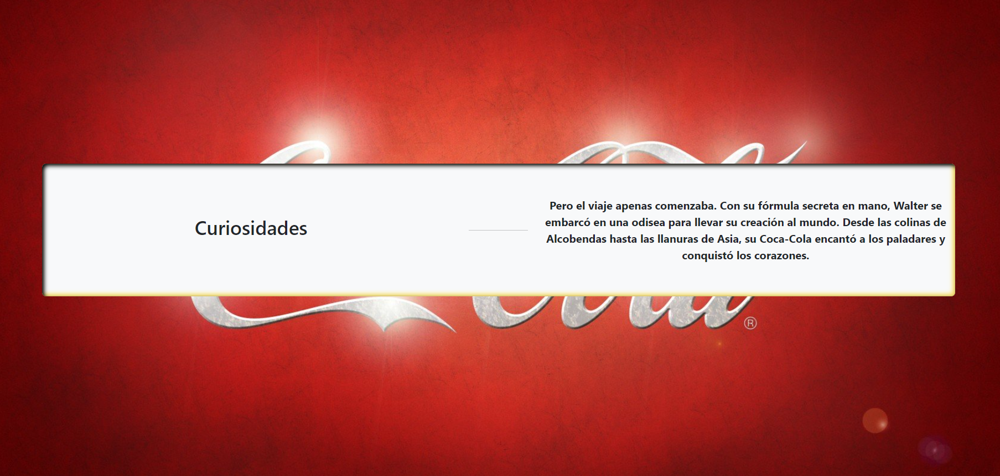

<h1>Memoria del proyecto fin de evaluación de Lenguajes de Marcas - 1º DAM/DAW</h1>
<h2>Walter's coke</h2>
<h2>Indice</h2>
<ul>
  <li><a href="#introduccion">Introducción</a></li>
  <li><a href="#motivacion">Motivación</a></li>
  <li><a href="#estructura">Estructura</a></li>
  <li><a href="#estilo">Estilo</a></li>
</ul>

<h2 id="introduccion">Introducción</h2>

Trabajo realizado en clase por: Antonio J. Heredia Leiva

Proyecto de web "from scratch" de 1ª evaluación de Lenguajes de Marcas

Enero de 2023 

Licencia CC-BY

<h2 id="motivacion">Motivación</h2>

El tema elegido es una sátira sobre la historia de cocacola mezclada con la vida de Walter White, el protagonista de la aclamada serie "Breaking Bad".   Es una historia ficticia, porque me encanta esta serie y me hacia gracia el tema por los inicios de la cocacola y su ingrediente secreto, además tenia que ver con el trabajo anterior(el de la receta) y ya que nuestro prota es químico pues ahí el point.  
He intentado que la historia tenga un sentido y que al final tenga un gancho, ya que como en todas las páginas la gente no entra por gusto, sino que tiene un porqué, un motivo, algo que atraiga.

<h2 id="estructura">Estructura</h2>

La web está dividida en 6 secciones principales, con sus distintas subdivisiones, todo maquetado con bootstrap excepto el fondo diseñado en parallax, quedando este fijo, dando la impresión de objetos volantes las demás secciones.

<ul>
  <li>
  
Hero Section

    <ul>
      <li>Barra de navegación</li>
      <li>Quote</li>
    </ul>
  </li>  
  <li>
  
Main container

    <ul>
      <li>Secciones informativas </li>
      <li>Seccion informativas con cards</li>
      <li>Secciones informativas con carrosel</li>
      <li>Seccion de formulario</li>
    </ul>
  </li>
  <li>
    
Footer

      <ul>
        <li> Fila con logo y localizacion </li>
        <li> Fila de redes </li>
        <li> Fila informativa y preguntas frecuentes </li>
      </ul>
  </li>
</ul>

<h3>Favicon</h3>

 Esta diseñado con DALLE-2 en Bing y luego he borrado el fondo en la página que adjunto la foto.
 
 

<h3>Hero Section</h3>

 Navbar, esta cogida de bootstrap, simple, sin buscador y luego le he modificado para que sea flex, el icono de "empresa" de walter's coke, esta hecho en una página dedicada a crear letreros son fuentes especiales llamada:_________ he creado el mismo letrero con distintos colores para que me sirva en los distintas secciones de la web. 

 

 La blockquote tiene un fondo con filtro blur, posicion relativa y tamaños con pixeles, al igual que la frase que esta posicionada encima de la misma manera. 

 

<h3>Inicio</h3>
  

He creado una pequeña historia hecha con Chat GPT, diseñada con una row y distintas columnas que cambian segun el tamaño de la pagina, maquetado con bootstrap

El diseño de esta "card" tiene un shadow inset creando la percepcion de estar incrustrado

<h3>Carrusel</h3>

 Lo he copiado literalmente de bootstrap, he intentado que las imagenes tengan buen contraste con los botones de slider y he modificado el width.  

<h3>Sigo con el hilo historico</h3>

 Mismo que la segunda sección.  

<h3>Galeria</h3>

 Esta galería tiene cards de bootstrap, con imagenes creadas con IA por Lexica.art  

 Las Cards estan modificadas para que la descripcion sea flex columns y que tengan un efecto hover 

 El contenedor de la galeria tiene un fondo con burbujas en png sin fondo con un tamaño y posicion modificado en CSS, ademas tiene un efecto con borde para que parezca un vaso con burbujas cuyo bordes inferiores estan redondeados con bootstrap 

<h3>Sigo con el hilo historico</h3>

 Mismo que la segunda sección.  

<h3>Formulario</h3>

 En el formulario he intentado que tenga una frase con gancho y un boton Call to Action, que sea llamativo con el tipo de boton warning de bootstrap, ya que me gustaba como quedaba y parecia que entraba con la armonia de colores.  

<h3>Footer</h3>

 Footer de mi pagina, consta con 3 subsecciones
  <ul>
    <li>Logo y localización </li>
    <li>Redes (con iconos de bootstrap) </li>
    <li>seccion informativa y de preguntas </li>
  </ul>  

<!-- voy por aqui -->
<h2 id="estilo">Estilo de la página</h2>
<h3>Paleta de colores</h3>

.....

<h3>Tipografías</h3>

Para la tipografía he incluido dos:
<ul>
    <li> EduTASBeginner-Regular.ttf </li>
    <li> Arimo-Medium.ttf </li>
</ul>

<h3>Imágenes</h3>

 Como he comentado anteriormente, dispongo de dos tipos de galerias en la web, una en forma de cards y otro tipo carrousel, creadas todas por IA

<h3>Videos</h3>

Tomado de Youtube, unos de mis youtubers favoritos de ciencia y fisica, Javier Santaolla

<h2 id="snippets">Code snippets</h2>

He utilizado los siguientes:

<ul>
  <li>Barra de navegación, contenido principal y footer: Bootstrap algo modificado</li>
  <li>Carrousel: tomado de bootstrap components</li>
  <li>Cards: tomado de botstrap pequeñamente modificado en CSS</li>
</ul>